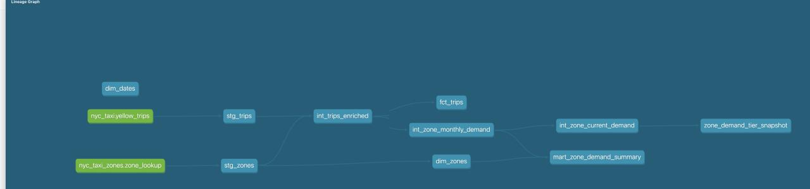

# NYC Taxi Analytics Engineering

A dbt + DuckDB warehouse built on a full year of NYC TLC's real Yellow Taxi trip data (39.7M trips, Jan–Dec 2024, loaded one month at a time), designed to demonstrate the things an analyst-only SQL project can't: a layered model architecture, incremental loading, a real SCD Type 2 dimension, data testing, and CI — not just a query that answers one question.

**Business framing:** an analytics team wants a self-serve warehouse for trip and zone-demand analysis, fed by TLC's monthly data drops, where "which zones are trending up or down in demand" is a question the data itself can answer (not just today's snapshot).

## Architecture

```
sources (external Parquet/CSV)
        │
        ▼
  staging/          1:1 with sources, cleaned + typed, incremental load
        │
        ▼
  intermediate/     joins, enrichment, business logic
        │
        ▼
  marts/            what analysts/BI tools actually query
        │
        ▼
  snapshots/        SCD Type 2 history on top of a marts-layer "current state" model
```



## Design decisions (and why)

**Incremental loading, not a full rebuild every time.** `stg_trips` (`models/staging/stg_trips.sql`) only processes rows with `pickup_datetime` later than what's already loaded. Real production warehouses receive new data continuously, not as one big backfill — so this project is built and tested the same way: all twelve months of 2024 loaded one at a time, in order, exactly as they'd arrive in production. See [Real results](#real-results-from-a-full-year-of-2024-data) below for what that actually produced — including three real bugs it caught along the way.

**The SCD Type 2 candidate isn't the zone lookup table.** The obvious "dimension that could have history" is `dim_zones` (TLC's LocationID → borough/zone mapping) — but that table essentially never changes, so snapshotting it would produce one static row per zone forever. Instead, `int_zone_current_demand` computes each zone's **current demand tier** (High/Medium/Low, by trip-count tercile that month) — a value that genuinely changes as new months of real data land — and `snapshots/zone_demand_tier_snapshot.sql` tracks *that* over time. This is the actual business question ("has this zone's demand classification shifted?"), and it's why a `check` strategy snapshot (not `timestamp`) is the right tool: there's no natural `updated_at` column on a derived aggregate.

**Staging filters bad data; it doesn't just flag it.** TLC's raw files reliably contain ~3% physically invalid rows (negative fares, zero/negative trip distance, dropoff before pickup, a stray pre-2009 timestamp). Nothing downstream can meaningfully use a trip with a negative fare, so these are filtered in `stg_trips`, not carried forward.

**Each row is validated against the month its own source file claims to represent, not just a global date range.** This one took three attempts to get right — see [The watermark-poisoning bug](#the-watermark-poisoning-bug-three-attempts-to-fix-it) below. It's the single most important lesson this project produced.

## Real results from a full year of 2024 data

Originally built and verified with just two months (Jan, then Feb added incrementally) to prove the mechanism worked. That was enough to prove the plumbing, but not enough to tell a real trend from a single noisy month — so the pipeline was extended to run all twelve months of 2024, each one downloaded and incrementally loaded in sequence, the same way monthly files would arrive in production:

| | |
|---|---|
| Total trips in `fct_trips` | **39,714,946** |
| Date range | exactly 2024-01-01 through 2024-12-31 |
| Zones tracked | 261 |
| Total snapshot versions recorded | 306 |

**229 of 261 zones (87.7%) stayed in the same demand tier for the entire year.** Demand at the zone level is fundamentally stable, not chaotic — which is itself a useful finding, not a non-result.

**32 zones (12.3%) changed tier at least once.** But the honest read of *why* matters here: comparing each zone's first and last recorded tier across the year shows no net citywide drift (9 zones net Low→Medium vs. 8 net Medium→Low; 4 net High→Medium vs. 4 net Medium→High — roughly balanced in both directions). The zones that changed most often didn't trend steadily up or down either — they oscillated:

| Zone | Borough | Tier history over the year |
|---|---|---|
| Roosevelt Island | Manhattan | Medium → Low → Medium → Low |
| Hunts Point | Bronx | Low → Medium → Low → Medium |
| Clinton Hill | Brooklyn | Medium → High → Medium → High |

That pattern — bouncing back and forth rather than climbing or falling — is the signature of a zone sitting right at a tercile boundary, where small month-to-month volume noise is enough to tip it across the line. Two months of data couldn't have told the difference between "this zone is trending" and "this zone is borderline and noisy"; twelve months can, and the honest answer for most of these is the latter.

Every one of these numbers is queryable with real `dbt_valid_from`/`dbt_valid_to` history in `snapshots.zone_demand_tier_snapshot` — "which zones are trending vs. just noisy" is a query away, not a re-analysis.

An earlier version of the snapshot also tracked `trip_count` and `avg_fare` as check columns, not just `demand_tier` — that produced 252/260 zones "changing" on the very first two-month test, because those figures drift by small amounts for nearly every zone regardless of whether anything meaningful shifted. Narrowing to just `demand_tier` is what makes the snapshot's history answer the question it's meant to answer — documented in the snapshot file itself.

## The watermark-poisoning bug (three attempts to fix it)

This is the most important bug this project found, because the first two fixes were both wrong in ways that looked right.

**The incident.** `stg_trips` is incremental: each run only loads rows with `pickup_datetime` later than the max already in the table (`WHERE pickup_datetime > (SELECT max(pickup_datetime) FROM {{ this }})`). While extending from two months to twelve, the June 2024 file turned out to contain 2 rows (out of 3.5 million) timestamped **2026-06-26** — garbage, two years in the future. Those 2 rows became the new high-water mark, so every subsequent run's `WHERE pickup_datetime > 2026-06-26` silently excluded **six real months of 2024 data**. Every test still passed — row counts, uniqueness, relationships were all internally consistent, just missing July through December. Nothing failed loudly; the only tell was a suspicious total when the numbers were checked by hand.

**Attempt 1 — `pickup_datetime <= current_date` — wrong, and wrong silently.** `current_date` means "today, wherever this pipeline happens to run," not "today relative to when this data was collected." On the machine this was built on, the system clock reads 2026-09-30 — comfortably *past* the 2026-06-26 poisoned rows. The filter compiled, ran, and reported success, while doing nothing at all.

**Attempt 2 — an explicit `max_valid_pickup_date` var, defaulting to `2025-01-01`.** This fixed the June incident for real (confirmed by rebuilding all twelve months and checking every month's count looked plausible). But it exposed a second, sneakier version of the same bug: the October 2024 file contains exactly one row timestamped **2024-11-14** — 13 days into the next month, but a perfectly *plausible* 2024 date. A global date-range bound can never catch this, because the row isn't implausible on its own — it's just in the wrong file. That one row pushed the watermark 13 days into November, and November's own run silently skipped Nov 1–14.

**Attempt 3 — validate each row against its own file's declared month.** The actual fix: `read_parquet(..., filename=true)` exposes each row's source file, and `stg_trips.sql` now requires `strftime(pickup_datetime, '%Y-%m')` to match the year-month extracted from that filename via `regexp_extract`. This is the correct mental model for monthly-partitioned source data — trust the partition, not cross-file timestamp ordering — and it catches both the June and October/November cases (and anything like them) regardless of how far off the bad timestamp is, because it never compares timestamps across files at all. The two date-range bounds from attempts 1–2 are kept as cheap, redundant checks for a different case (a timestamp implausible in *any* file, like the 2002 and 2026 rows), but they're no longer load-bearing for this failure mode.

**Why this is the most important bug in the project:** it's a textbook illustration of why a naive `max()`-based incremental filter is fragile — a single corrupt or mis-timestamped row doesn't just cause a wrong value, it silently poisons every run after it, and no schema test catches a *missing* row the way it catches a *wrong* one. Two fix attempts looked correct, ran successfully, and were still wrong. The only thing that actually caught it was checking the real output against what was expected — 39.7M trips across 12 months looked right; 19.5M across a handful of visible months plus a max date of "2026" did not.

## Also found: two duplicate-row incidents

Separate from the watermark bug, `stg_trips`'s surrogate key (`trip_id`, generated from vendor/timestamps/locations/fare since the raw data has no natural primary key) caught two real data quality issues via unique-key test failures:

- **Paired charge/reversal billing records.** TLC's export contains pairs of rows — a charge and its exact reversal (e.g. `total_amount` of `-4.00` and `+4.00`) — that are otherwise identical. 83 such collisions surfaced when `total_amount` wasn't yet part of the surrogate key. Fixed by adding it.
- **A fully duplicated raw row.** One incremental run later, a single trip in the February file turned out to be byte-for-byte duplicated — every column identical, not just the surrogate-key columns. Fixed with `QUALIFY ROW_NUMBER() OVER (PARTITION BY trip_id ...) = 1` in staging.

## Running it

Requires Python and the [DuckDB CLI](https://duckdb.org/docs/installation) (or just `pip install duckdb` for the CLI too).

```bash
python3 -m venv .venv
source .venv/bin/activate
pip install dbt-core dbt-duckdb
dbt deps
export DBT_PROFILES_DIR=$(pwd)   # profiles.yml lives in this repo, not ~/.dbt/

# Get the data -- see data/README.md for the month-by-month load walkthrough
dbt build
dbt docs generate && dbt docs serve   # optional: browse the docs site + DAG
```

To reproduce the full-year run yourself: download all twelve `yellow_tripdata_2024-*.parquet` files (see [data/README.md](data/README.md)), then load and `dbt build` one month at a time, in order — that's what actually exercises the incremental model and builds real snapshot history. Loading all twelve files at once and running once will still build correctly, it just won't show the incremental/SCD2 behavior doing anything.

## Testing

34 data tests across the DAG: not-null/unique on every primary key, `relationships` tests tying `fct_trips` back to `dim_zones`, `accepted_values` on vendor/payment codes, custom `dbt_utils.expression_is_true` checks on fare, distance, and the pickup-date upper bound, and a `unique_combination_of_columns` test on the zone/month grain. Run `dbt test` on its own, or `dbt build` to run models and tests together in dependency order.

Worth noting explicitly: **none of these 34 tests caught the watermark-poisoning bug.** Uniqueness, not-null, and relationships were all satisfied by the (incomplete) data that made it through. The bug was only caught by checking real output against expectations, not by any schema test — a good reminder that tests catch wrong values far more easily than they catch missing ones.

## CI

[](https://github.com/noahfighter883/nyc-taxi-analytics-engineering/actions/workflows/ci.yml)

Every push runs `dbt build` **twice** against small synthetic fixtures (`data/sample/`) — once with only a "January" fixture, then again with "February" added — so CI actually exercises the incremental model and the snapshot across two runs, not just proves the SQL compiles. See [.github/workflows/ci.yml](.github/workflows/ci.yml).

## Repo structure

```
data/
  README.md                how to get the real data, and the month-by-month load walkthrough
  raw/                      gitignored -- real monthly Parquet files + zone lookup go here
  sample/                   small synthetic fixtures (two months) used by CI
models/
  staging/                  1:1 with sources, cleaned/typed/incremental, tests
  intermediate/             joins, enrichment, the zone-demand-tier logic
  marts/                    fct_trips, dim_zones, dim_dates, mart_zone_demand_summary
snapshots/
  zone_demand_tier_snapshot.sql   the SCD Type 2 history
scripts/
  generate_sample_data.py   regenerates the CI fixtures in data/sample/
docs/
  dag.png                   lineage graph screenshot
.github/workflows/
  ci.yml                    two-stage incremental build on every push
dbt_project.yml, profiles.yml, packages.yml
```

## Tools

dbt-core + dbt-duckdb (no cloud warehouse or credentials needed), dbt_utils, GitHub Actions.
